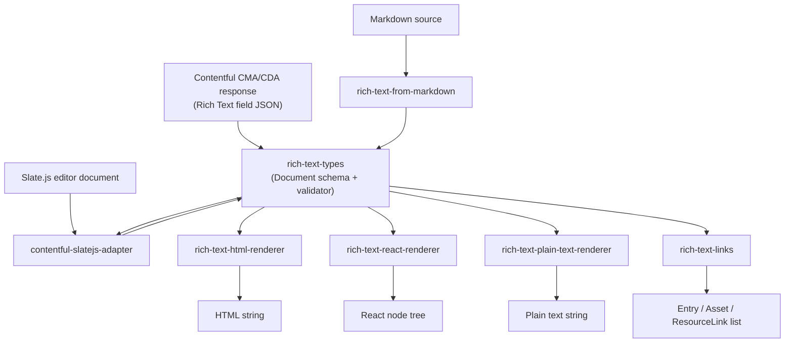

# Architecture

## 1. Overview

`rich-text` is a pnpm/Nx monorepo of seven independently-versioned TypeScript packages that define, validate, convert, and render Contentful's Rich Text document format. Contentful's Rich Text field is stored and delivered as a JSON node tree (not HTML); this repo owns the canonical type definitions for that tree and the tools consumers use to turn it into HTML, React, plain text, or a link list, plus tools to build a tree from markdown or a Slate.js editor document. [`package.json`, `README.md`, `catalog-info.yaml`]

## 2. System Context

This repo has no runtime dependents *within* this repo — it is consumed by external applications and packages that need to read or produce Contentful Rich Text content. Confirmed public consumers (verified by reading their `package.json`/README, not exhaustive):

- [`contentful.js`](https://github.com/contentful/contentful.js) — Contentful's official JavaScript SDK — depends directly on `@contentful/rich-text-types`.
- [`field-editors`](https://github.com/contentful/field-editors) `packages/rich-text` (`@contentful/field-editor-rich-text`) — "the React `RichTextEditor` component that is used as the default for RichText field type in the Contentful web application," per that package's README.
- Third-party integrations such as [`marketplace-partner-apps`](https://github.com/contentful/marketplace-partner-apps) depend on `@contentful/rich-text-html-renderer`.

This diagram is built from `import`/`dependencies` statements found in each package's `src/index.ts` and `package.json`.

## 3. Internal Structure

| Package | Purpose |
| --- | --- |
| `rich-text-types` | Shared `Document`/`Block`/`Inline`/`Text`/`Mark` type definitions, the `BLOCKS`/`INLINES`/`MARKS` enums, schema constraints (which node types may nest under which), the `EMPTY_DOCUMENT` constant, and `validateRichTextDocument()`. Every other package in this repo depends on it. [`packages/rich-text-types/src/index.ts`] |
| `rich-text-html-renderer` | `documentToHtmlString()` — renders a `Document` to an HTML string, with per-`nodeType`/mark renderer overrides. [`packages/rich-text-html-renderer/src/index.ts`] |
| `rich-text-react-renderer` | `documentToReactComponents()` — renders a `Document` to a React node tree. [`packages/rich-text-react-renderer/src/index.tsx`] |
| `rich-text-plain-text-renderer` | `documentToPlainTextString()` — flattens a `Document` (or any `Block`/`Inline` subtree) to a plain-text string. [`packages/rich-text-plain-text-renderer/src/index.ts`] |
| `rich-text-links` | `getRichTextEntityLinks()`, `getRichTextResourceLinks()`, `getAllRichTextResourceLinks()` — extracts Entry/Asset/`ResourceLink` references from a `Document` via tree traversal. [`packages/rich-text-links/src/index.ts`] |
| `rich-text-from-markdown` | Converts a markdown string to a Rich Text `Document` using `remark-parse` + `remark-gfm` (via `unified`). [`packages/rich-text-from-markdown/src/index.ts`] |
| `contentful-slatejs-adapter` | Bidirectional adapter between Slate.js editor documents and Rich Text `Document` structures. [`packages/contentful-slatejs-adapter/README.md`, `packages/contentful-slatejs-adapter/src/index.ts`] |

## 4. Data Flow

**Rendering (HTML / React):**

1. `documentToHtmlString(document, options)` / `documentToReactComponents(document, options)` receives a `Document`.
2. If `options.stripEmptyTrailingParagraph` is set, `helpers.stripEmptyTrailingParagraphFromDocument()` removes a trailing empty paragraph first.
3. The tree is walked recursively; for each node, a renderer function is looked up by `node.nodeType` in a merged map (`{ ...defaultNodeRenderers, ...options.renderNode }`).
4. Text nodes apply each of their `marks` in sequence through the merged mark-renderer map, then are escaped/interpolated into the parent's output.
5. Output is built bottom-up: string concatenation for HTML, `ReactNode` composition for React.
   [`packages/rich-text-html-renderer/src/index.ts`, `packages/rich-text-react-renderer/src/index.tsx`]

**Link extraction:**

1. `getRichTextEntityLinks()` / `getRichTextResourceLinks()` / `getAllRichTextResourceLinks()` receive a `Document`.
2. `visitNodes()` performs an iterative depth-first traversal (explicit stack, not recursion) over every node.
3. Nodes whose `data.target` shape matches a `Link` (`sys.type: 'Link'`, entity type `Entry`/`Asset`) or `ResourceLink` (`sys.type: 'ResourceLink'`) are collected into a `Map`, keyed by `sys.id` or `sys.urn` to deduplicate.
4. The map's values are returned as an array.
   [`packages/rich-text-links/src/index.ts`]

**Markdown import:**

1. `unified().use(markdown).use(gfm).parse(...)`-style pipeline parses the markdown string into an mdast tree (`remark-parse` + `remark-gfm`).
2. A lookup table (`markdownNodeTypes`) maps mdast node types (`paragraph`, `heading`, `link`, `list`, `table`, ...) to Rich Text `BLOCKS`/`INLINES` values; a second table (`markTypes`) maps `emphasis`/`strong`/`inlineCode`/`delete` to Rich Text marks.
3. The mapped tree is assembled into a Rich Text `Document`.
   [`packages/rich-text-from-markdown/src/index.ts`]

**Validation:**

1. `validateRichTextDocument(document)` asserts the root `nodeType` is `BLOCKS.DOCUMENT`.
2. Each node is recursively checked against a per-`nodeType` assertion table (`nodeValidator`) built from `schemaConstraints.ts` — e.g. paragraphs/headings only accept inline-or-text content; list items only accept `LIST_ITEM_BLOCKS`; table cells reject unknown `data` properties.
3. Returns an array of `ValidationError` (empty array = valid).
   [`packages/rich-text-types/src/validator/index.ts`]

## 5. Domain Concepts

- **Document** — root node, `nodeType: BLOCKS.DOCUMENT`, `content` is an array of `TopLevelBlock`. Immutable data value (no lifecycle/state machine). **Invariant:** only node types listed in `TOP_LEVEL_BLOCKS` may appear as direct children. **Gotcha:** `EMPTY_DOCUMENT` defines "empty" as exactly one paragraph containing one text node with `value: ''` — any other shape is not considered empty by the library's own constant, even if visually blank. [`packages/rich-text-types/src/emptyDocument.ts`, `packages/rich-text-types/src/schemaConstraints.ts`]
- **Block / Inline / Text / Mark** — the four node kinds. `Block.content` and `Inline.content` are arrays of further nodes; `Text.value` is a string and `Text.marks` is an array of `Mark` (`{ type: string }`). [`packages/rich-text-types/src/types.ts`]
- **Void blocks** — `HR`, `EMBEDDED_ENTRY`, `EMBEDDED_ASSET`, `EMBEDDED_RESOURCE` must have empty `content` arrays; enforced by the validator's void-content assertion. [`packages/rich-text-types/src/schemaConstraints.ts`]
- **Link vs. ResourceLink** — two distinct reference shapes. `Link` (`sys.type: 'Link'`, `sys.id`, `sys.linkType: 'Entry'|'Asset'`) is the original same-space reference. `ResourceLink` (`sys.type: 'ResourceLink'`, `sys.urn`) is a newer shape used for cross-space entity references. Consumers must branch on `sys.type`, not assume one shape. [`packages/rich-text-types/src/types.ts`]
- **`V1_NODE_TYPES` / `V1_MARKS`** — the node/mark set that existed "before tables release" / "before superscript & subscript release." These are historical markers in the type package, not a runtime-enforced version gate — nothing in this repo reads them to reject newer node types at runtime `[INFERRED]`. [`packages/rich-text-types/src/schemaConstraints.ts`]

This section documents the four structural node *kinds* and the cross-cutting invariants; the full enumeration of concrete node-type interfaces (`Heading1`–`Heading6`, `Paragraph`, `Quote`, `Hr`, `OrderedList`/`UnorderedList`/`ListItem`, `Table`/`TableRow`/`TableCell`/`TableHeaderCell`, `EntryLinkBlock`/`AssetLinkBlock`/`ResourceLinkBlock`, `Hyperlink` and its `Entry`/`Asset`/`Resource` variants — 20+ interfaces total) lives in `packages/rich-text-types/src/nodeTypes.ts`, `blocks.ts`, and `inlines.ts` and is not repeated here node-by-node.

## 6. Key Dependencies

None. No external service, datastore, queue, or HTTP client is imported anywhere in `packages/*/src` (`[Source: grep -rniE "SNS|SQS|DynamoDB|S3Client|axios|fetch\(" packages/*/src` returned zero matches, and `grep -rn "process\.env" packages/*/src` returned zero matches`]`). The only non-`rich-text-types` runtime dependencies are markdown-parsing libraries (`remark-parse`, `remark-gfm`, `unified`) and `lodash`, used exclusively by `rich-text-from-markdown`. [`packages/rich-text-from-markdown/package.json`]

If this is unavailable (e.g. a downstream package fails to resolve `@contentful/rich-text-types`), every renderer/converter package fails to build or import — there is no graceful-degradation path, since it is a compile-time/import-time dependency, not a runtime call.

## 7. Configuration

No runtime environment variables — these are libraries, not services. Build/publish-time configuration only:

| File | Purpose | Default |
| --- | --- | --- |
| `.npmrc` | `registry=https://registry.npmjs.org`, `ignore-scripts=true`, `shamefully-hoist=true` (pnpm hoisting, needed for the Nx/flat `node_modules` layout) | n/a |
| `.nvmrc` | Node version pin | `v24` |
| `package.json` → `packageManager` | pnpm version pin | `pnpm@10.33.0` |
| `.contentful/vault-secrets.yaml` | Vault policies available to the `release` GitHub Actions job (`github-comment`, `semantic-release`, `packages-read`) | n/a |

`.contentful/compressed-size.yml` declares a bundle-size-tracking config (gzip, `packages/*/{dist,build}`),
but the CI job that consumed it was dropped when CI migrated from CircleCI to GitHub Actions — the migration commit explicitly notes "Drops the compressed-size job (no GH Actions equivalent exists org-wide) — flagged as a follow-up." `[POSSIBLY DEAD CONFIG — declared but no active CI step consumes it as of this run]`
[`140b093` — `chore(ci): migrate from CircleCI to GitHub Actions`]

## 8. Operational Knowledge

**Deployment (release):** On every push to `master`, GitHub Actions runs `build` → `check` → `release`.
The `release` job runs `nx release version` (computes each changed package's next semver from conventional commits since its last tag and pushes a `@contentful/<package>@<version>` git tag — it does not commit to the working tree), then `nx release publish` (publishes each newly-tagged package to npm and creates a GitHub Release). [`.github/workflows/ci.yml`, `.github/workflows/release.yaml`, `CONTRIBUTING.md`]
